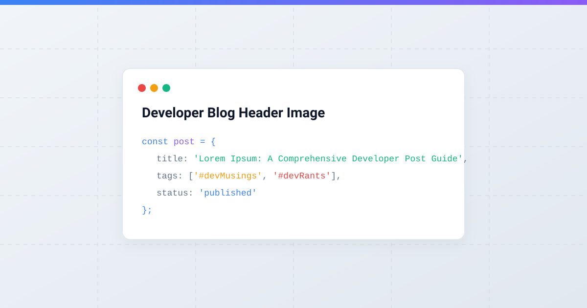

# Introduction to the Blueprint Template

Lorem ipsum dolor sit amet, consectetur adipiscing elit. Sed do eiusmod tempor incididunt ut labore et dolore magna aliqua. Ut enim ad minim veniam, quis nostrud exercitation ullamco laboris nisi ut aliquip ex ea commodo consequat.

This post serves as a **live template & blueprint** for creating future articles on this developer blog. It demonstrates all available frontmatter attributes, image embeds, code formatting options, tag lists, and typography styles.

---

## 1. Frontmatter Metadata Reference

When creating a new blog post, place the YAML metadata at the very top of your `.md` file inside its dedicated post directory (`posts/<YYYY>/<MM>/<slug>/<slug>.md`):

```yaml
---
title: "Your Post Title Here"
slug: "your-post-title-here"
date: "2026-07-28"
updated: "2026-07-28" # Optional
preface: "A concise 1-2 sentence summary of what this post covers."
tags:
  - devMusings # Special tag featured in navbar
  - devRants   # Special tag featured in navbar
  - javascript
  - webdev
headerImage: "assets/images/header-placeholder.svg" # Optional
---
```

---

## 2. Text Formatting & Typography

Lorem ipsum dolor sit amet, **consectetur adipiscing elit**, sed do eiusmod tempor *incididunt ut labore* et dolore magna aliqua. You can also highlight `inline code` or use strike-through text like ~~outdated ideas~~.

### Blockquotes & Callouts

> **Pro Tip for Developers:**
> Lorem ipsum dolor sit amet, consectetur adipiscing elit. Keeping client-side code lightweight ensures instantaneous page transitions and optimal mobile performance.

---

## 3. Code Snippets & Syntax Highlighting

Here are sample code blocks in multiple languages demonstrating syntax highlighting:

### JavaScript Async Function
```javascript
// Fetch and parse markdown post content dynamically
async function loadBlogPost(slug) {
  try {
    const response = await fetch(`./posts/${slug}.md`);
    if (!response.ok) throw new Error(`HTTP Error ${response.status}`);
    const rawMarkdown = await response.text();
    
    // Extract Frontmatter and Body
    const { metadata, body } = parseFrontmatter(rawMarkdown);
    console.log("Loaded metadata for:", metadata.title);
    return { metadata, html: marked.parse(body) };
  } catch (error) {
    console.error("Failed to load post:", error);
    return null;
  }
}
```

### Clean CSS Variables (Flat Theme)
```css
/* Core Design Tokens */
:root {
  --bg-main: #f8fafc;
  --bg-card: #ffffff;
  --text-main: #0f172a;
  --text-muted: #64748b;
  --accent-primary: #3b82f6;
  --border-subtle: #e2e8f0;
}
```

### HTML5 Semantic Markup
```html
<article class="post-detail">
  <header class="post-header">
    <h1 class="post-title">Lorem Ipsum Post Title</h1>
    <p class="post-preface">Sample preface text goes here.</p>
  </header>
  <div class="post-content">
    <!-- Rendered Markdown HTML -->
  </div>
</article>
```

---

## 4. Lists & Structured Data

### Key Features Checklist
- [x] Responsive layout with flat aesthetic
- [x] Pre-rendered static HTML for 100% "View Page Source" visibility
- [x] Date-nested clean URLs (`/posts/2026/07/sample-lorem-ipsum-post/`)
- [x] Colocated Markdown `.md` source files right beside `index.html`
- [x] Special tags support (`#devMusings`, `#devRants`)
- [x] Automatic 50-word summary truncation on home screen

### Ordered Steps for Adding New Posts
1. Create a new directory `posts/<YYYY>/<MM>/<slug>/`.
2. Add your `.md` content file inside it (`posts/<YYYY>/<MM>/<slug>/<slug>.md`).
3. Add a matching entry in `posts/posts.json`.
4. Run `npm run build` to compile clean static HTML files!

---

## 5. Header & Inline Images

Below is an example of an inline image embed with alt text:



---

## Conclusion

Lorem ipsum dolor sit amet, consectetur adipiscing elit. Duis aute irure dolor in reprehenderit in voluptate velit esse cillum dolore eu fugiat nulla pariatur. Excepteur sint occaecat cupidatat non proident, sunt in culpa qui officia deserunt mollit anim id est laborum.
