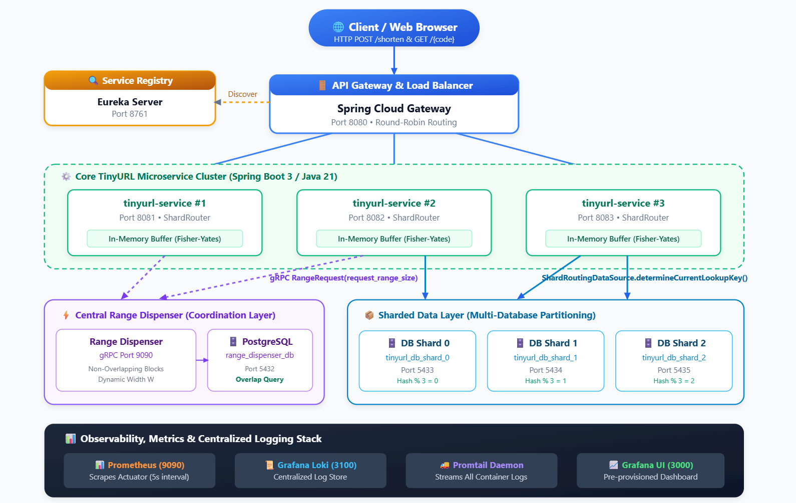
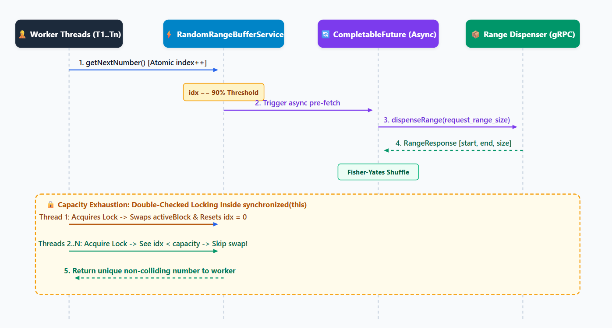

Building a production-ready, distributed system from scratch is rarely a linear journey. Setting out to build a highly scalable **TinyURL system** using modern cloud-native standards—**Spring Boot 3 (Java 21)**, **gRPC**, **Spring Cloud (Eureka & API Gateway)**, **multi-database PostgreSQL sharding**, **Prometheus/Grafana observability**, **Loki log aggregation**, and **Kubernetes manifests**— I chose to pair program with an autonomous AI coding agent (Antigravity).

It began with an one **"Mega-Prompt"** which quickly evolved through deep architectural iterations: eliminating multi-threaded race conditions, deriving dynamic database shard routing without configuration drift, enabling dynamic range block sizing with PostgreSQL interval intersection guarantees, and getting complete 14-container monitoring topology up and running.

In this article, I will share the architectural blueprint of the system, the chronological evolution of the codebase, and most importantly, practical takeaways on **how to drive AI agents efficiently using high-density, constraint-driven prompts** and **why continuous human code auditing remains non-negotiable**.

---

## The System Design Blueprint

At its core, a scalable URL shortener must satisfy several hard requirements:
1. **Massive Capacity & Compact URLs**: 6-character Base62 alphanumeric short codes `[a-zA-Z0-9]`, yielding about 56.8 Billion unique combinations.
2. **Zero Key Collisions & High Throughput**: Guaranteeing uniqueness without costly centralized database locks or synchronous coordination per HTTP request.
3. **Horizontal Partitioning (Database Sharding)**: Distributing URL mappings across multiple isolated PostgreSQL databases based on consistent hash routing.
4. **Resilient Observability & Monitoring**: Sub-second metric scraping via Prometheus, centralized log streaming with Grafana Loki and Promtail, and auto-provisioned Grafana dashboards.

### End-to-End System Topology



---

## The Initial "Mega-Prompt" & Kickoff

I started by giving the agent a comprehensive, multi-paragraph architectural specification—a **"mega-prompt"**—detailing the exact multi-module project structure, database schemas, gRPC protobuf contracts, Spring Cloud components, and Docker Compose topology.

However, complex distributed systems are not built in a single prompt. Real-world edge cases, multi-threaded concurrency traps, and configuration drift require continuous refinement.

---

## Deep Iterations & Solving Real Bugs

### 1. Concurrency Trap: Thread Contention & Duplicate Range Allocation
In `RandomRangeBufferService.java`, each instance of `tinyurl-service` maintains an in-memory buffer of numbers pre-shuffled via Fisher-Yates shuffle. When 90% of the block is consumed, an asynchronous pre-fetch is triggered.



**The Bug Found During Code Review**:
Initially, when the active block was exhausted (`idx >= BLOCK_SIZE`), multiple threads waiting on `synchronized (this)` would each invoke `fetchAndShuffleBlock()` one after another. This caused multiple gRPC range fetches, discarding valid numbers and causing heavy lock contention.

**The Fix (Double-Checked Locking)**:
We instructed the agent with a targeted prompt to introduce double-checked locking inside the synchronized block:

```java
public long getNextNumber() {
    while (true) {
        int idx = currentIndex.getAndIncrement();
        int currentBlockSize = activeBlock.length;
        int refillThreshold = (int) (currentBlockSize * (refillThresholdPercentage / 100.0));

        if (idx == refillThreshold) {
            // Trigger async pre-fetch at dynamic threshold
            if (prefetchTriggered.compareAndSet(false, true)) {
                log.info("Reached threshold {}/{}. Triggering async pre-fetch.", refillThreshold, currentBlockSize);
                nextBlockFuture = CompletableFuture.supplyAsync(this::fetchAndShuffleBlock);
            }
        }

        if (idx < currentBlockSize) {
            return activeBlock[idx];
        }

        // Block exhausted: Double-check inside synchronized block before swapping
        synchronized (this) {
            if (currentIndex.get() >= activeBlock.length) {
                log.info("Active block exhausted. Swapping with pre-fetched block...");
                long[] newBlock;
                if (nextBlockFuture != null) {
                    newBlock = nextBlockFuture.join();
                    this.nextBlockFuture = null;
                } else {
                    newBlock = fetchAndShuffleBlock();
                }
                this.activeBlock = newBlock;
                this.currentIndex.set(0);
                this.prefetchTriggered.set(false);
            }
        }
    }
}
```

---

### 2. Single-Source-of-Truth Dynamic Shard Routing
Initially, `UrlMappingService` routed keys using a hardcoded modulo: `Math.abs(code.hashCode()) % 3`.

When starting the application with set number of database shards, hardcoding `% 3` or having a separate `tinyurl.sharding.count` property in `application.yml` creates configuration drift if someone adds a fourth datasource under `spring.datasource` but forgets to update the count.

`ShardRoutingDataSource` had to be refactored to dynamically track the count of registered target datasources (`targetDataSources.size()`):

```java
public class ShardRoutingDataSource extends AbstractRoutingDataSource {

    private int shardCount = 1;

    @Override
    public void setTargetDataSources(Map<Object, Object> targetDataSources) {
        super.setTargetDataSources(targetDataSources);
        if (targetDataSources != null && !targetDataSources.isEmpty()) {
            this.shardCount = targetDataSources.size();
        }
    }

    public int getRegisteredShardCount() {
        return shardCount;
    }

    @Override
    protected Object determineCurrentLookupKey() {
        return DbContextHolder.getShardIndex();
    }
}
```

And `ShardRouter` delegates dynamically:

```java
@Component
public class ShardRouter {

    private final ShardRoutingDataSource routingDataSource;

    public ShardRouter(ShardRoutingDataSource routingDataSource) {
        this.routingDataSource = routingDataSource;
    }

    public int getShardIndex(String code) {
        if (code == null) return 0;
        return Math.abs(code.hashCode()) % routingDataSource.getRegisteredShardCount();
    }
}
```

---

### 3. Dynamic Range Size Allocation with Interval Overlap Protection
In the latest iteration, `tinyurl-service` was updated to specify its own desired buffer width (e.g. `tinyurl.range.buffer-size: 5000` or `10000`).

To guarantee that different range widths never produce overlapping keyspaces, `RangeDispenserAllocationService` uses SQL interval intersection queries:

```java
@Query("SELECT COUNT(r) > 0 FROM DispensedRange r WHERE r.startValue <= :endValue AND r.endValue >= :startValue")
boolean existsOverlappingRange(@Param("startValue") Long startValue, @Param("endValue") Long endValue);
```

---

## The Art of Prompting: Precision vs. Ambiguity

One of the biggest lessons from this project is the direct correlation between **prompt quality** and **agent efficiency**.

When working with autonomous AI agents, vague prompts lead to hallucinations, broken assumptions, and wasted iteration loops. High-density, constraint-driven prompts lead to clean, single-pass implementations.

| Aspect | Vague / Ambiguous Prompting | High-Precision Constraint Prompting |
| :--- | :--- | :--- |
| **Locality** | *"The buffer has some multi-threading issues, please fix it."* | *"In `RandomRangeBufferService.java` at `getNextNumber()`, threads waiting on `synchronized(this)` call `fetchAndShuffleBlock()` multiple times upon exhaustion. Implement double-checked locking on `currentIndex.get() >= activeBlock.length`."* |
| **Configuration** | *"Make the database shards dynamic."* | *"In `tinyurl-service`, derive the shard count directly from `targetDataSources.size()` in `ShardRoutingDataSource` so `ShardRouter` has a single source of truth without redundant YAML properties."* |
| **Contracts** | *"Update the range dispenser."* | *"Update `range_dispenser.proto` to add `int32 request_range_size = 2` to `RangeRequest`. In `range-dispenser-service`, check interval overlaps using `r.startValue <= :endValue AND r.endValue >= :startValue`."* |
| **Execution Mode** | Jumping straight into random code edits. | Using `/plan` mode to review architectural changes, diffs, and verification strategies before touching code. |

---

## Why Continuous Human Code Auditing is Non-Negotiable

AI coding assistants are exceptionally capable at boilerplate generation, API wiring, and refactoring. However, **the human engineer remains the architect and primary auditor**.

Throughout the sessions, active code auditing caught critical items that automated linters alone would miss:
1. **Subtle Concurrency & State Invariants**: Identifying race conditions where multiple threads wake up from lock contention.
2. **Configuration Drift**: Catching decoupled configuration keys (`tinyurl.sharding.count` vs `spring.datasource.shard*`) and enforcing single-source architectures.
3. **Database Schema Correctness**: Ensuring PostgreSQL tables, unique constraints, and sequence types align with long-term keyspace capacities (56.8B numbers exceeding 32-bit integers require `int64` / `BIGINT`).
4. **Dependency Hygiene**: Eliminating duplicate Maven dependencies (such as duplicate `postgresql` driver entries) and managing gRPC BOM version alignment.

---

## Production Kubernetes Topology

All configurations, health checks, and metrics endpoints are baked into clean, production-grade Kubernetes manifests under the [`k8s/`](https://github.com/jeetprakash/system-design-tinyurl/tree/main/k8s) directory:

```bash
k8s/
├── 01-service-registry.yaml    # Eureka Server + Actuator Probes
├── 02-range-dispenser.yaml     # Range Dispenser + PostgreSQL StatefulSet
├── 03-tinyurl-shards.yaml      # 3x PostgreSQL DB Shard StatefulSets
├── 04-tinyurl-service.yaml     # 3x TinyURL Pods + Dynamic Range Configs
├── 05-api-gateway.yaml         # Spring Cloud Gateway LoadBalancer
└── 06-monitoring-logging.yaml  # Prometheus, Loki, Promtail & Grafana
```

To deploy the entire stack to Kubernetes cluster:
```bash
kubectl apply -f k8s/
```

---

## Conclusion

Pair programming with an AI agent to build a distributed system is like having a high-speed junior/mid-level developer pairing with a senior architect. 

When you provide **clear, bounded architectural requirements**, **use structured planning modes**, and **rigorously audit the generated code**, you can build, containerize, and test complex microservices architectures in a fraction of the traditional development time.

The full source code, Kubernetes manifests, and Grafana dashboard configurations are available on GitHub:
**[github.com/jeetprksh/system-design-tinyurl](https://github.com/jeetprksh/system-design-tinyurl)**
