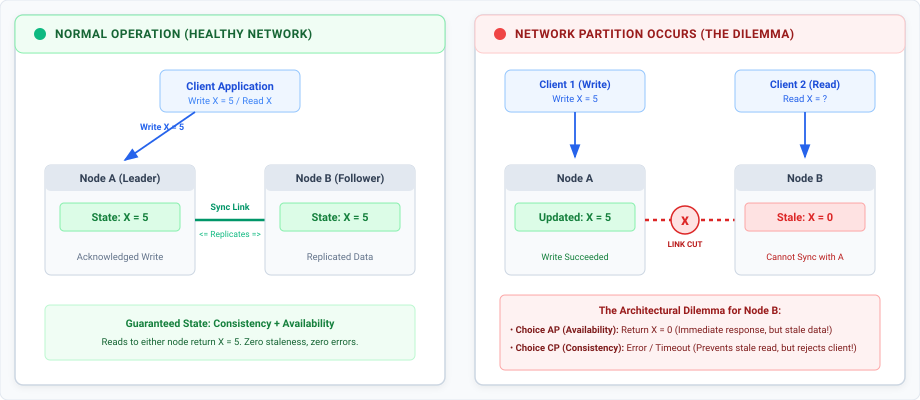
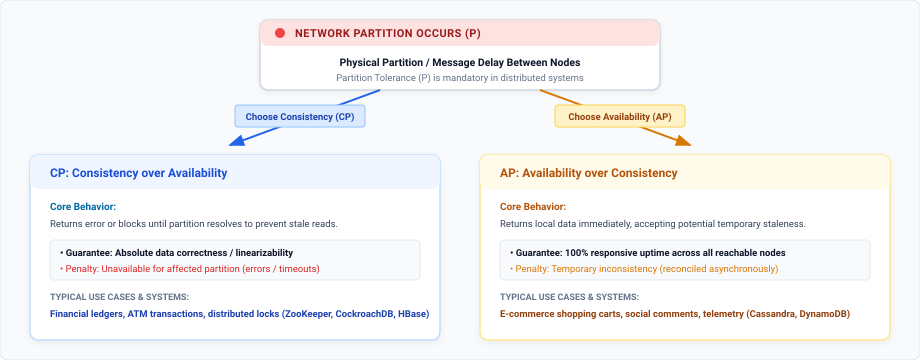
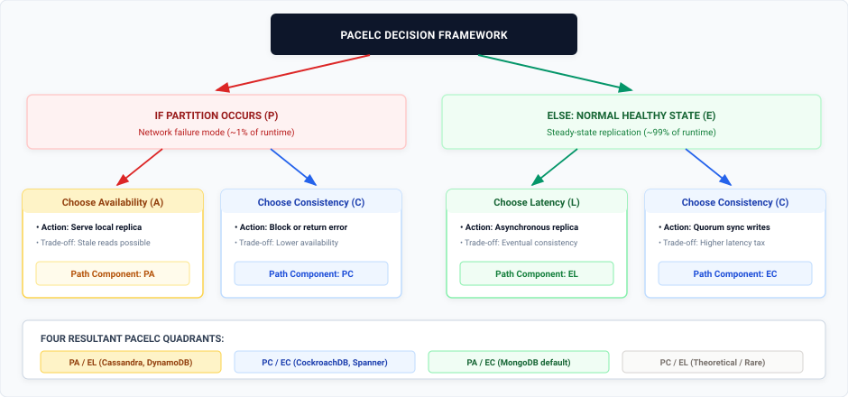

Every distributed design implementation eventually hits three ubiquitous letters: **CAP**. We are often told that when building a distributed database, we have three choices: Consistency, Availability, and Partition Tolerance and we must pick any two. 

However, in modern software architecture, the popular "pick two out of three" framing is not always true all the time. The CAP theorem is completely silent about how the database should behave during the 99% of the time when the network is healthy.

In this post, we will break down what the CAP theorem actually guarantees, the crucial real-world concerns it leaves out, and explore **PACELC** an alternative framework engineers can use to reason about distributed trade-offs.

---

## The CAP Theorem

The **CAP theorem** states that a distributed data store cannot simultaneously provide all three of the following guarantees:

*   **Consistency (C):** Every read receives the most recent write or an error. All nodes see the exact same data at the exact same time. In CAP, consistency refers to **linearizability** (atomic consistency), where writes appear instantaneous across all replicas. *Note that this is distinct from the 'C' in ACID transactions, which guarantees database integrity constraints.*
*   **Availability (A):** Every non-failing node returns a non-error response for every request. It guarantees that the system stays responsive without failing, though the returned data may be stale.
*   **Partition Tolerance (P):** The system continues to operate despite arbitrary message loss, delays, or network failure between nodes.

### The Network Partition Trade-off

To visualize why we cannot have all three guarantees at once, consider a simple two-node distributed database consisting of **Node A** and **Node B**:

1. **The Event:** A network partition disconnects Node A from Node B.
2. **The Write:** Client 1 writes a new value (`X = 5`) to Node A. Because of the network partition, Node A cannot replicate this update to Node B.
3. **The Read:** Client 2 immediately requests `X` from Node B.

Node B now faces an impossible dilemma:
*   **Option 1 (Prioritize Availability - AP):** Node B responds immediately with its current value (`X = 0`). The request succeeds, but the client receives stale, inconsistent data.
*   **Option 2 (Prioritize Consistency - CP):** Node B refuses to respond or returns an error because it cannot verify whether Node A received an update. Data correctness is preserved, but availability is sacrificed.

### The "Pick Two" Myth

Beginners often assume they can select any combination: CP, AP, or CA. However, **"CA" distributed systems do not exist**. 

Network failures, severed fiber cables, switch outages, dropped packets are the physical reality in distributed environments. We cannot "choose not to have partitions". If we build a system that ignores Partition Tolerance (P), we have built a fragile monolith deployed across multiple machines rather than a resilient distributed system.

Thus, the actual CAP decision is narrower: **When a network partition occurs, do we choose Consistency (CP) or Availability (AP)?**

*   **CP Systems (Consistency over Availability):** Systems like finance ledgers, fund transfers, and ticketing services choose CP. If an ATM loses its network link to central servers, it refuses the transaction rather than risk dispensing money from an unverified account balance.
*   **AP Systems (Availability over Consistency):** Social media comments/posts, and video like counts choose AP. If a network glitch occurs, Instagram still lets us view the comments on a post, fetching the latest comments later rather than sending error response.

---

## Concerns the CAP Theorem Does Not Address

While CAP provides a foundational baseline, relying on it alone leaves massive blind spots in system design.

### 1. The "99% Normal Case" Ignored
Network partitions are rare events in well-managed data centers, network partitions might occur 1% of the time or less. **CAP is completely silent on how a database behaves during the 99% of normal operations when the network is perfectly healthy**.

### 2. Latency vs. Consistency Trade-offs
Even with no network partition, replicating data across multiple nodes forces a continuous design trade-off between **latency** and **consistency**. 
*   If we demand strong consistency on every write, we must wait for updates to propagate across all replicas before acknowledging success, which introduces high latency.
*   If we prefer low latency, we acknowledge writes instantly on a single replica and replicate asynchronously in the background, accepting a brief window where clients might read stale data.
CAP does not capture this everyday latency penalty.

### 3. Binary Absolutism vs. Real-World Granularity
CAP models properties as binary toggles (100% consistent or 0% consistent, 100% available or 0% available). In reality, systems operate across a spectrum of consistency levels (e.g., eventual, causal, read-your-writes, linearizable) and availability SLA thresholds.

### 4. Absence of Performance SLA Boundaries
According to CAP's formal definition, a database that takes 1 hour to return a query is technically "available" as long as it returns a non-error response. In real-world engineering, a 30-second latency spike renders the APIs getting timed-out for users.

---

## The Need for PACELC Over CAP

To bridge the critical gaps left by CAP theorem PACELC extends it by taking normal-state performance into aaccountas well.

### Understanding the PACELC Formula

PACELC is an acronym representing two conditional trade-offs:

  <strong>If P</strong> (Partition) &rarr; Choose <strong>A</strong> (Availability) or <strong>C</strong> (Consistency) 
  <strong>Else E</strong> (Normal Operation) &rarr; Choose <strong>L</strong> (Latency) or <strong>C</strong> (Consistency)

By explicitly evaluating the "Else" clause (**ELC**), PACELC captures the replication choices engineers make while configuring database settings, write concerns, and read preferences.

### The Four PACELC System Classifications

PACELC categorizes distributed databases into four primary spectrums:

| PACELC Class | Partition State (P) Trade-off | Normal State (E) Trade-off | Typical Use Cases & Systems |
| :--- | :--- | :--- | :--- |
| **PA/EL** | Availability | Low Latency | High-throughput feeds, telemetry, shopping carts (*Cassandra, DynamoDB*) |
| **PC/EC** | Consistency | Consistency | Financials, locks, balance ledgers (*CockroachDB, Spanner, ZooKeeper*) |
| **PA/EC** | Availability | Consistency | Primary-Secondary document stores with failover (*MongoDB default*) |
| **PC/EL** | Consistency | Low Latency | Theoretical edge case (demands consistency in failure, sacrifices it in health) |

#### 1. PA/EL Systems (High Availability & Low Latency)
*   **Behavior:** During partitions, these systems trade consistency for availability (PA). Under normal conditions, they prioritize sub-millisecond response times over immediate consistency (EL) by replicating asynchronously.
*   **Examples:** Apache Cassandra, Amazon DynamoDB, Riak.
*   **Best For:** Social media feeds, shopping carts, session stores, and real-time gaming leaderboards where speed preserves user experience and eventual consistency is acceptable.

#### 2. PC/EC Systems (Consistency in All Cases)
*   **Behavior:** When partitioned, they refuse requests to prevent serving stale data (PC). During normal operations, they pay a latency tax by blocking writes until a quorum of replicas confirms the data (EC).
*   **Examples:** Google Bigtable, Apache HBase, Apache ZooKeeper, TiDB, CockroachDB.
*   **Best For:** Core financial ledgers, billing systems, distributed locking, and inventory management where data corruption or overselling is catastrophic.

#### 3. PA/EC Systems (Available on Partition, Consistent Normally)
*   **Behavior:** In normal operations, writes and reads default to a primary node to guarantee consistency (EC). If a partition isolates the primary, the system elects a new primary to accept writes, preserving availability (PA).
*   **Examples:** MongoDB (default replica set configuration).
*   **Best For:** Content management and e-commerce applications desiring strict consistency under normal loads with automated failover handling.

#### 4. PC/EL Systems (Rare / Theoretical)
*   **Behavior:** Choose consistency during partitions but sacrifice consistency for lower latency during normal operations. Because systems valuing consistency in failure modes usually demand it during normal operation, PC/EL configurations are rare in production.

---

### Tunable Consistency: Moving Beyond Fixed Classifications

Modern databases are rarely locked into a single fixed quadrant. Most engines provide **tunable consistency controls** that allow developers to adjust PACELC behaviors per operation:

*   **Cassandra & DynamoDB:** Allow developers to specify read/write consistency levels per query (e.g., `ONE`, `QUORUM`, `ALL`), trading latency for strong consistency on demand.
*   **Azure Cosmos DB:** Offers five distinct consistency choices ranging from Strong and Bounded Staleness to Eventual consistency.
*   **Modern Consensus Engines:** Systems like CockroachDB leverage Raft consensus to execute rapid recovery and low-latency synchronous replication, narrowing the performance gap between PC/EC safety and PA/EL responsiveness.

---

## Conclusion

The CAP theorem remains a foundational concept for understanding how distributed systems behave when networks fail. However, because network partitions represent a small fraction of system runtime, relying solely on CAP leaves out crucial day-to-day decisions.

**PACELC provides the complete picture**:
*   **CAP** answers: *"What happens when the network breaks?"*
*   **PACELC** answers: *"What trade-offs are we making every other day of the year?"*

When evaluating databases or answering distributed system challenges, frame the architectural choices around business requirements: determine whether the application can tolerate stale reads for speed, or if it must pay the latency tax to guarantee absolute data correctness.
