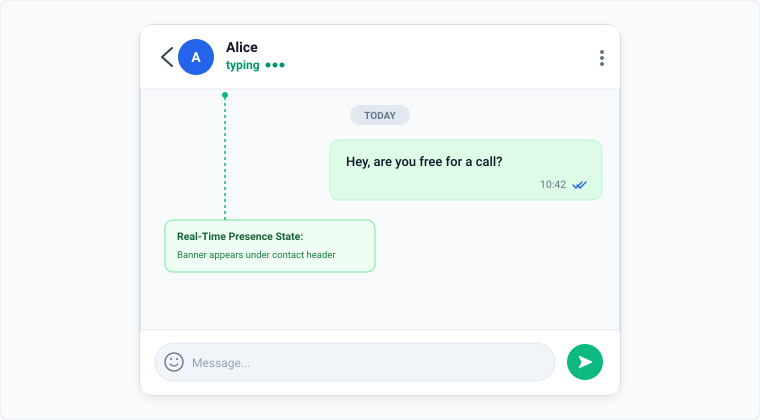
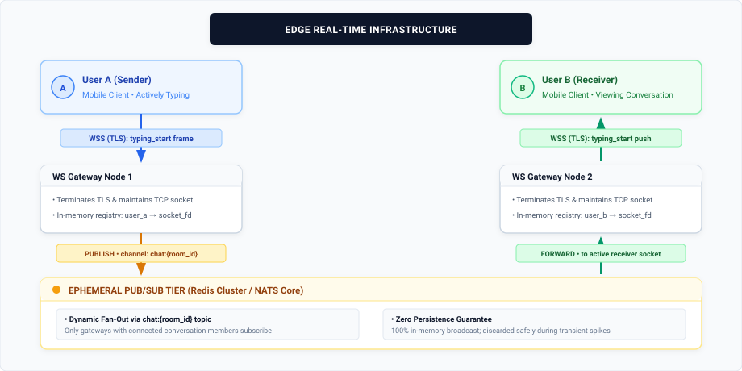
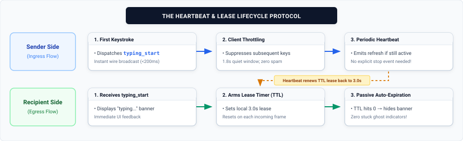
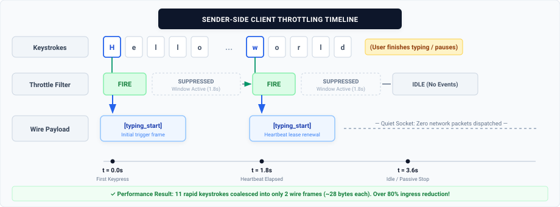
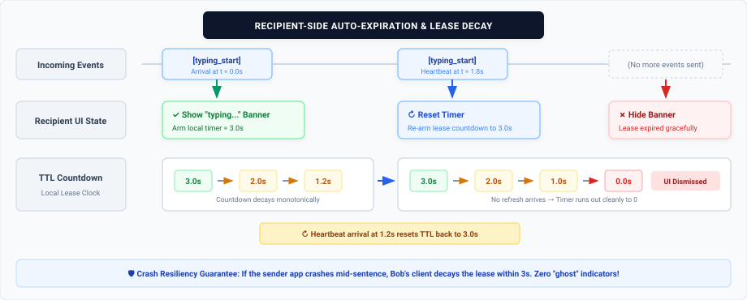
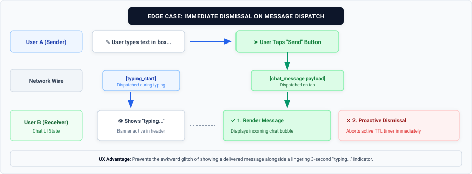

When messaging someone on WhatsApp, one of the most familiar and subtle pieces of interface feedback is the dynamic *"typing..."* indicator that appears right below the recipient's contact name. 



While this presence feature feels like an elementary boolean switch to the end user, delivering real-time typing state across billions of globally distributed devices presents a deceptively complex distributed systems problem. 

How do we broadcast keystroke intent with sub-200ms latency, prevent network saturation, avoid battery drain, and guarantee that a crashed app doesn't leave a "ghost" typing indicator stuck on the other person's screen forever?

Let's dissect the architecture behind a **User Typing Indicator**.

---

## Why the Naive HTTP API Model Fails

When developers first consider implementing a typing indicator, the very first solution is often to map user interactions to standard RESTful endpoints:
1. Fire a `POST /api/chat/{id}/typing/start` request when the user presses a key.
2. Fire a `POST /api/chat/{id}/typing/stop` request when the user stops or loses focus.

While intuitive, this pattern collapses under the performance and reliability requirements of real-time messaging:

* **Massive Header & Protocol Overhead:** A typing event conveys mere bytes of useful information (e.g., `{"userId": 42, "status": "typing"}`). Wrapping this in an HTTP/1.1 or even HTTP/2 envelope incurs TLS framing, cookies, headers, and authorization tokens that are orders of magnitude larger than the payload itself.
* **Request Amplification & Ingress Churn:** A user typing at 60 words per minute can easily generate hundreds of discrete events in a single conversation. Multiplying that by millions of concurrent conversations results in an avalanche of HTTP transactions that can choke API gateways and worker pools.
* **The "Ghost Indicator" on Network Drops:** If an app crashes, gets force-closed, or abruptly loses cell coverage while the user is mid-sentence, the client never gets the chance to transmit the `typing_stop` request. The recipient's UI is left permanently indicating that the sender is still typing.
* **Transport Asymmetry:** HTTP is a half-duplex, client-to-server protocol. Even if the sender posts an event over HTTP, the backend still requires a persistent push transport (such as WebSockets or Server-Sent Events) to deliver that state to the recipient. Using HTTP on the ingress side creates unnecessary protocol fragmentation.

---

## A Better Approach: WebSockets + Pub/Sub

To achieve minimal network overhead and bidirectional low-latency communication, we rely on persistent **WebSockets (`wss://`)** coupled with an ephemeral messaging tier.

### High-Level Distributed Architecture



### Architectural Responsibilities

1. **WebSocket Gateways:** Stateful edge servers terminate TLS and maintain open TCP connections with connected clients. Each gateway holds an in-memory session registry mapping connected `user_id`s to their corresponding local socket descriptor.
2. **Ephemeral Pub/Sub Tier (Redis / NATS):** Gateway nodes do not maintain peer-to-peer links with every other node. Instead, when an event arrives for a specific conversation, the receiving node publishes the event to a lightweight room channel (`chat:{room_id}`). Only gateways hosting active recipients of that conversation subscribe to the channel, fanning out the message directly to the recipient's socket.
3. **Zero Persistence Guarantee:** Typing indicators are ephemeral by definition. They must **never** be written to disk, relational databases, or durable commit logs. If a typing frame is dropped due to transient network congestion, it can be safely discarded.

---

## Optimization: Need for `typing_stop`?

The `typing_start` event warrants the existence of the corresponding `typing_stop` event too. But is it really needed?
The most critical optimization in an efficient typing indicator system is the complete elimination of explicit `typing_stop` network packets.

Instead of a pair of start/stop events, the design relies on a **Recipient Auto-Expiration Lease**.



### 1. Sender-Side Throttling

Sending a WebSocket frame on every single keystroke is wasteful. To balance responsiveness and efficiency, the client implements a rate-throttling mechanism:

* **Initial Stroke:** The very first keystroke dispatches a `typing_start` payload immediately over the WebSocket connection so the recipient sees the banner with zero perceivable delay (<200ms).
* **Heartbeat Window:** While the user continues typing, additional keystrokes within a set window (e.g., T(heartbeat) = 1.8 seconds) are suppressed locally.
* **Periodic Refresh:** If the user continues actively typing beyond that window, the client emits a subsequent `typing_start` frame to serve as a presence refresh.



The payload sent across the wire is minimal:

```json
{
  "t": "TYPING",
  "cid": "c_98214",
  "uid": "u_4501"
}
```

---

### 2. Recipient-Side Auto-Expiration (TTL)

The recipient's client is responsible for expiring the typing state passively. Rather than waiting for an explicit stop event, it treats every incoming `typing_start` as a time-bounded event.

* **Display & Bind Timer:** When the recipient client receives a `typing_start` packet, it immediately displays the *"typing..."* banner and starts a countdown timer (e.g., T(expire) = 3 seconds).
* **Timer Reset:** If a fresh `typing_start` heartbeat arrives before the countdown expires, the timer resets back to 3 seconds.
* **Passive Fade-Out:** When the sender stops typing, the sender client stops transmitting heartbeats. The recipient's timer naturally count down to zero, and the UI smoothly removes the indicator.



### Why This Design Eliminates Edge Cases

1. **Unclean Disconnections:** If Alice's phone runs out of battery, loses cellular reception, or the app is killed by the OS, her client immediately stops transmitting heartbeats. Within 3 seconds, Bob's client expires the lease and hides the indicator automatically.
2. **Network Jitter & Reordering:** In a start/stop architecture, packet reordering could cause `stop` to arrive before `start`, causing the indicator to get stuck on indefinitely. With a monotonic lease model, missed or reordered packets simply decay cleanly.
3. **50% Traffic Reduction:** Eliminating the stop phase cuts overall network traffic and server routing overhead in half.

---

## Edge Case Handling

While passive expiration handles pauses and dropouts, two edge cases require immediate, proactive cancellation:

### 1. Message Dispatched
When the user finishes typing and taps **Send**, waiting 3 seconds for the indicator to decay creates an inconsistent user experience (the message would be visible alongside the typing banner).



**Resolution:** When the recipient client receives an actual incoming message payload, it immediately cancels any active typing countdown timer for that sender and clears the indicator instantly.

### 2. Input Cleared (Backspace)
If a user types a sentence and then repeatedly hits backspace until the text field is empty, waiting 3 seconds for the indicator to decay is unnecessary.

**Resolution:** If the input field's length transitions to zero, the client emits an explicit lightweight `typing_cancel` frame to dismiss the indicator immediately.

---

## High-Scale Optimization: Large Group Chats

In a 1-on-1 WhatsApp chat, publishing typing events creates negligible load. However, in group chats with hundreds of members, broadcasting presence unconditionally creates an `O(N)` fan-out explosion:

```text
Packets Dispatched = Active Typers * Group Members - 1
```

If 5 users are typing simultaneously in a 500-member community group, the system would need to process thousands of presence frames per second for a single chat room.

To keep gateway load manageable for a group chat scenario:
* **Suppression Thresholds:** For groups larger than a defined threshold (e.g., >50 members), typing indicators can be completely disabled or restricted to showing a generic aggregated label (e.g., *"several people are typing..."*) throttled at a coarse backend interval.
* **Active-Screen Gating:** Clients only listen to typing events for the conversation thread that is currently open on the user's screen. If the user is on the main chat list, background typing events for individual groups are dropped at the gateway layer.

---

## Wrapping Up

Building a real-time indicator feature like WhatsApp's typing indicator highlights an important principle in distributed system design: sometimes the most resilient solution is not to build synchronization mechanisms, but to design protocols that naturally expire.

By moving from an explicit start-stop lifecycle to a lightweight heartbeat with client-side auto-expiration, we cut network traffic in half, eliminate lingering ghost states, and deliver a smooth, responsive presence experience at scale.