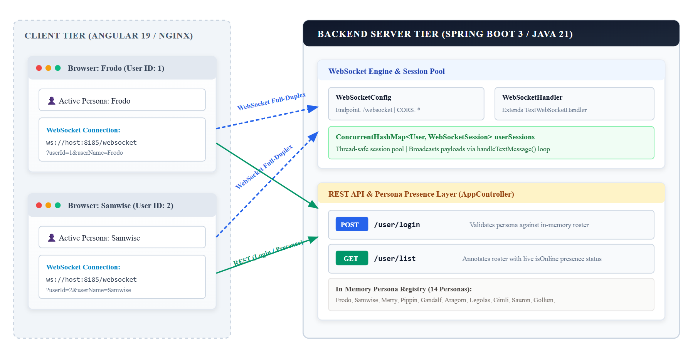

# WebSocket Real-Time Chat Platform

A low-latency, bidirectional multi-client chat application implemetned with a **Spring Boot 3 (Java 21)** backend, an **Angular 19** single-page web application, and full **Docker Compose** container orchestration.

The system demonstrates WebSocket lifecycle management, thread-safe concurrent session pooling, dynamic hostname resolution for containerized and LAN environments, and real-time active user presence tracking.

---

## Demo

Following video demonstrats two browser sessions (*Frodo* and *Samwise*) authenticating and exchanging real-time chat messages bidirectionally:

<div style="margin: 1.5rem 0; text-align: center;">
  <video controls style="max-width: 100%; width: 720px; border-radius: 8px; border: 1px solid var(--border-color); box-shadow: 0 4px 12px rgba(0,0,0,0.06);" poster="">
    <source src="./chat.mp4" type="video/mp4">
    Your browser does not support HTML5 video streaming.
  </video>
  <p style="font-size: 0.85rem; color: var(--text-muted); margin-top: 0.5rem;"><em>Bidirectional real-time chat between authenticated personas</em></p>
</div>

---

## System Architecture

The following diagram illustrates the complete topology, communication protocols, and runtime interaction between the client applications, Docker network, and the backend WebSocket engine:



---

## Backend Architecture (Spring Boot 3 & WebSockets)

The backend is built with **Spring Boot 3** and **Java 21**.

### 1. WebSocket Protocol Configuration

The WebSocket configuration registers the `/websocket` endpoint and enables cross-origin requests from any frontend origin (`setAllowedOrigins("*")`):

```java
package com.chat.config;

import com.chat.websocket.WebSocketHandler;
import org.springframework.beans.factory.annotation.Autowired;
import org.springframework.context.annotation.Configuration;
import org.springframework.web.socket.config.annotation.EnableWebSocket;
import org.springframework.web.socket.config.annotation.WebSocketConfigurer;
import org.springframework.web.socket.config.annotation.WebSocketHandlerRegistry;

@Configuration
@EnableWebSocket
public class WebSocketConfig implements WebSocketConfigurer {

    @Autowired
    private WebSocketHandler webSocketHandler;

    @Override
    public void registerWebSocketHandlers(WebSocketHandlerRegistry registry) {
        registry.addHandler(webSocketHandler, "/websocket")
                .setAllowedOrigins("*");
    }
}
```

---

### 2. Thread-Safe WebSocket Handler & Session Pooling

Spring's `TextWebSocketHandler` manages WebSocket lifecycles. Sessions are indexed in a `ConcurrentHashMap<User, WebSocketSession>`:

- **Handshake User Extraction**: When a client establishes a connection (`ws://host:8185/websocket?userId=1&userName=Frodo`), `getUserFromSession()` parses the query parameters from `session.getUri()`.
- **Session Registration**: `afterConnectionEstablished` registers the new session in the concurrent map and logs active session metrics.
- **Broadcast Engine**: When any user transmits a `TextMessage`, `handleTextMessage()` iterates across all registered sessions in `userSessions.values()` and broadcasts the message in real time.
- **Graceful Cleanup**: `afterConnectionClosed` automatically dereferences the user from the pool upon socket disconnection or network dropouts.

---

### 3. REST API & Dynamic Presence Aggregation

`AppController` provides two core REST endpoints:

1. **`POST /user/login`**: Authenticates a user by matching their chosen persona name against an in-memory registry of 14 personas (*Frodo, Samwise, Gandalf, Aragorn, Legolas, Gimli, Gollum, Sauron, etc.*). Returns `200 OK` with user details or `401 UNAUTHORIZED`.
2. **`GET /user/list`**: Returns the full user roster where each user's `isOnline` boolean is dynamically resolved by querying `webSocketHandler.getOnlineUsers()`.

```java
@CrossOrigin
@RestController
public class AppController {

    @Autowired
    private WebSocketHandler webSocketHandler;

    @RequestMapping(value = "/user/login", method = RequestMethod.POST)
    public User userLogin(@RequestBody LoginRequest loginRequest, HttpServletResponse response) {
        return getValidUsers().stream()
                .filter(u -> u.getUserName().equalsIgnoreCase(loginRequest.getName()))
                .findFirst()
                .orElseGet(() -> {
                    response.setStatus(HttpServletResponse.SC_UNAUTHORIZED);
                    return null;
                });
    }

    @RequestMapping(value = "/user/list", method = RequestMethod.GET)
    public List<User> listUsers() {
        List<User> validUsers = getValidUsers();
        Set<User> onlineUsers = webSocketHandler.getOnlineUsers();
        validUsers.forEach(validUser -> validUser.setOnline(onlineUsers.contains(validUser)));
        return validUsers;
    }
}
```

---

## Web Frontend Architecture (Angular 19)

The web frontend (`chat-ui/`) is developed with **Angular 19** and structured with modular services and components.

### 1. Dynamic Host Resolution

To ensure seamless deployment across `localhost`, custom Docker bridge networks, and local area network (LAN) IP addresses, the application dynamically resolves the WebSocket connection target from the browser window's current host location:

```typescript
// Dynamic WebSocket URI Resolution
const host = window.location.hostname;
const socketUrl = `ws://${host}:8185/websocket?userId=${currentUser.id}&userName=${currentUser.userName}`;
const socket = new WebSocket(socketUrl);
```

### 2. Frontend Capabilities
- **Persona Authentication**: Clean modal to pick and authenticate as any character from the Middle-earth user roster.
- **Active Presence Sidebar**: Real-time user roster featuring green active status pills indicating which users currently maintain an active WebSocket connection.
- **Bidirectional Chat Room**:
  - Message bubble distinction (outgoing messages aligned right with accent color; incoming messages aligned left with neutral card styling).
  - Formatted sender avatars and timestamps.
  - Automatic scrolling upon receiving new broadcast payloads.

---

## Containerization & Docker Orchestration

The app is fully containerized with multi-stage Docker builds and orchestrated using **Docker Compose**:

### Multi-Stage Dockerfiles

| Service | Build Stage | Runtime Stage | Exposed Port |
| :--- | :--- | :--- | :--- |
| **`websocket-chat-server`** | Maven Wrapper + Java 21 SDK | Eclipse Temurin 21 JRE (`alpine`) | `8185:8185` |
| **`websocket-chat-ui`** | Node.js 20 (`npm run build`) | Nginx 1.25 Alpine | `80:80` |

### Docker Compose Configuration (`docker-compose.yaml`)

```yaml
services:
  websocket-chat-server:
    build: ./server
    ports:
      - "8185:8185"

  websocket-chat-ui:
    build: ./chat-ui
    ports:
      - "80:80"
```

---

## Getting Started & Local Development

### Option A: One-Line Docker Compose (Recommended)

From the root directory:

```bash
docker compose up --build
```

- Access the web interface at **`http://localhost`**
- WebSocket server runs at **`ws://localhost:8185/websocket`**

---

### Option B: Local Development (Individual Services)

#### 1. Start Backend Server
```bash
cd server
./mvnw spring-boot:run
```

#### 2. Start Angular Frontend
```bash
cd chat-ui
npm install
npm start
```

---

## Future Roadmap

While the current architecture provides a clean, low-latency foundation for real-time communication, the following enhancements presents the future evolution path:

### 1. Dedicated Mobile Phone Application
- **Native Mobile Clients**: Extending the chat platform with a native mobile client built to handle mobile lifecycle events (app suspend/resume, background state, and device rotation).
- **Push Notification Integration**: Incorporating Firebase Cloud Messaging (FCM) so users receive message alerts even when the WebSocket connection is idle or the app is closed.

### 2. Decoupled WebSocket Gateways & API Microservices
- **Traffic Segregation for High Availability**: Separating the persistent WebSocket connection layer from standard stateless HTTP REST traffic.
- **Stateless REST Services**: Isolating user authentication, persona discovery, and account services into independently auto-scaled stateless microservices behind an API Gateway (e.g., Spring Cloud Gateway / Nginx Ingress).

### 3. Distributed Message Broker for Multi-Node Fan-Out
- **Cluster-Wide Broadcasting**: Upgrading the single-instance in-memory `ConcurrentHashMap` session pool with a distributed message broker (such as **RabbitMQ**, **Redis Pub/Sub**, or **Apache Kafka**).
- **Multi-Instance Scalability**: When User A (connected to WebSocket Node 1) sends a message, Node 1 publishes the event to the broker topic. The broker immediately fans out the payload to WebSocket Node 2, Node 3, and Node $N$, delivering messages to recipients connected to any server instance in the cluster.

### 4. Message Persistence & Cross-Session Retention
- **Durable Message Storage**: Introducing a persistent database layer (e.g., PostgreSQL for relational query integrity or MongoDB/Cassandra for high-write chat logging) combined with Redis for hot message caching.
- **Session Rehydration & History Sync**: Enabling users to retrieve historical conversation threads, paginate older messages on scroll, and maintain chat continuity when logging in from new devices or browser sessions.
- **Delivery Status & Receipts**: Tracking *sent*, *delivered*, and *read* receipts alongside unread message badges.

---

The complete open-source repository is available on GitHub:
**[github.com/jeetprksh/websocket-chat](https://github.com/jeetprksh/websocket-chat)**
